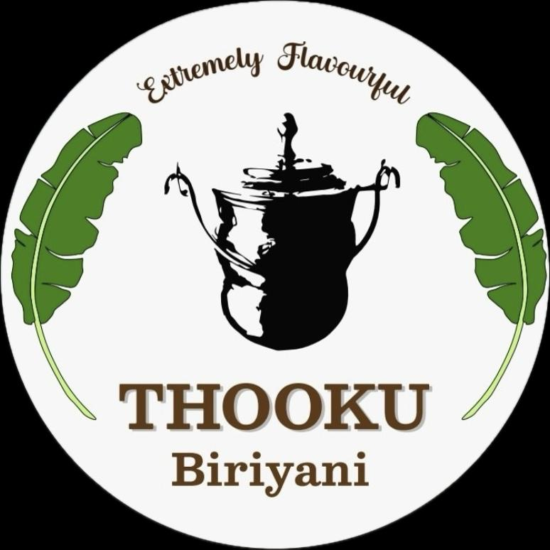

# Thooku Biriyani

<div align="center">
  
  
  [](https://thooku-biriyani.vercel.app)
  
  
  
  
</div>

## About

A modern restaurant web application built with Next.js 13+. Features include menu browsing, cart management, secure checkout, and admin dashboard for order management.

🔗 **[Live Demo](https://thooku-biriyani.vercel.app)**

## Features

- Menu browsing with categories
- Real-time cart management
- Secure checkout process
- User authentication
- Admin dashboard
- Order tracking
- Customer testimonials
- Responsive design
- Dark/Light theme

## Tech Stack

- Next.js 13+ (App Router)
- React 18
- TypeScript
- Redux Toolkit
- TailwindCSS
- NextAuth.js
- Bun Runtime

## Getting Started

```bash
# Install dependencies
npm install

# Run development server
npm run dev

# Build for production
npm run build
npm start
```

## Project Structure

```
src/
├── app/                    # Next.js app directory
│   ├── _components/       # Shared components
│   ├── auth/             # Authentication
│   ├── cart/             # Shopping cart
│   ├── checkout/         # Checkout process
│   ├── dashboard/        # Admin dashboard
│   └── menu/             # Menu pages
├── components/ui/         # UI components
├── lib/                   # Utilities
└── Store/                # Redux store
```

---

<div align="center">
  <p>Developed by <a href="https://github.com/Ranjithdurai451">Ranjith.D</a></p>
</div>